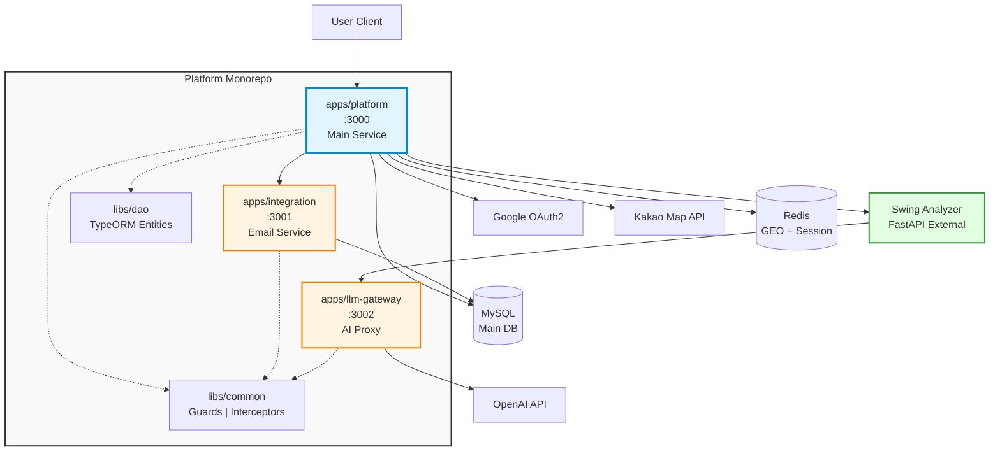

# 🏌️ Golf Platform

> **실무 MSA 패턴을 적용한 골프장 통합 플랫폼**  
> NestJS Monorepo | 3-Service Architecture | Redis GEO | LLM Gateway

---

## 🛠️ 기술 스택

### 핵심 기술


### 상세 기술 스택

| 카테고리                | 기술 스택                                                                                        |
| ----------------------- | ------------------------------------------------------------------------------------------------ |
| **Backend & Framework** | NestJS, TypeScript, Node.js                                                                      |
| **Database**            | MySQL (TypeORM)                                                                                  |
| **Cache & Session**     | Redis (ioredis)                                                                                  |
| **External APIs**       | OpenAI API, Google OAuth2, Nodemailer (SMTP)                                                     |
| **DevOps & CI/CD**      | Docker, Docker Compose, GitHub Actions                                                           |
| **Code Quality**        | Husky, Lint-staged, ESLint, Prettier                                                             |
| **Shared Libraries**    | `libs/common` (Guards, Interceptors, Decorators)<br/>`libs/dao` (TypeORM Entities, Repositories) |

---

## 🎯 프로젝트 소개

실무에서 경험한 MSA 패턴과 인프라 자동화 및 AI를 개인 프로젝트에 적용한 포트폴리오입니다.

**핵심 가치**

- 🏗️ **관심사 분리(SoC)**: 3개 서비스로 비즈니스 로직 / 통합 / LLM을 완전 분리
- 🔄 **코드 재사용**: Monorepo 구조로 Guard, Interceptor, DAO 공유
- 🚀 **장애 격리**: LLM 오류 시에도 골프장 탐색 기능은 정상 작동
- 💰 **비용 최적화**: Redis 캐싱으로 OpenAI API 비용 절감

---

## ✨ 핵심 기능

**🗺️ 위치 기반 골프장 탐색**

- Redis GEO 기반 5km 반경 실시간 검색
- 응답 속도: 평균 10ms 이내 (PostGIS 대비 3배 개선)
- 즐겨찾기 기능으로 자주 가는 골프장 관리

**📅 예약 시스템**

- 캘린더 통합으로 예약 일정 관리
- 예약 확인 이메일 자동 발송 (SMTP)
- 사용자별 예약 히스토리 조회

**🔐 Google OAuth2 인증**

- AES-256 암호화 기반 토큰 저장
- Refresh Token 자동 갱신 로직
- JWT 기반 세션 관리

**🤖 LLM 중앙 관리 (Gateway)**

- OpenAI/Claude API 통합
- Redis 캐싱으로 동일 요청 비용 절감
- 프롬프트 템플릿 관리
- 사용량 로깅 및 비용 추적

---

## 🏗️ 아키텍처

### 시스템 구성도



---

### 3-Service MSA 구조

| 서비스               | 포트                      | 역할               | 주요 기능                       |
| -------------------- | ------------------------- | ------------------ | ------------------------------- |
| **apps/platform**    | `SERVER_PORT`             | 메인 비즈니스 로직 | 인증, 골프장 탐색, 예약, 캘린더 |
| **apps/integration** | `SERVER_PORT`             | 외부 서비스 통합   | 이메일 발송 (SMTP)              |
| **apps/llm-gateway** | `LLM_GATEWAY_SERVER_PORT` | LLM API 중앙 관리  | OpenAI/Claude 프록시, 캐싱      |

> **💡 Tip**: 각 서비스의 포트는 `config/` 디렉토리의 환경 변수 파일에서 설정합니다.

---

### 서비스 간 통신 플로우

```
👤 사용자
  ↓
📱 apps/platform (메인 앱)
  ├─→ 📧 apps/integration (예약 이메일 발송)
  └─→ 🔬 Swing Analyzer (FastAPI, 별도 레포)
        └─→ 🤖 apps/llm-gateway (스윙 피드백 생성)
              └─→ 🧠 OpenAI API
```

**핵심 포인트:**

- `integration`과 `llm-gateway`는 **직접 통신하지 않음**
- `platform` → `integration`: 예약 이메일 발송 요청
- `platform` → `Swing Analyzer` → `llm-gateway`: AI 분석 플로우

---

## 🚀 Quick Start

### 1️⃣ 사전 요구사항

```
Node.js >= 18
pnpm >= 8
Docker & Docker Compose
```

---

### 2️⃣ 설치 및 실행

```bash
# 1. 레포지토리 클론
git clone https://github.com/wjdghtls95/platform.git
cd platform

# 2. 의존성 설치
pnpm install

# 3. Docker 컨테이너 실행 (MySQL, Redis)
docker-compose up -d

# 4. 환경 변수 설정
cp .env.example .env
# .env 파일을 열어서 필요한 값 입력 (Google OAuth, OpenAI API Key 등)

# 5. 데이터베이스 마이그레이션
pnpm run migration:run

# 6. 모든 앱 실행
pnpm run start:dev platform      # config/platform.env의 SERVER_PORT 사용
pnpm run start:dev integration   # config/integration.env의 SERVER_PORT 사용
pnpm run start:dev llm-gateway   # config/llm-gateway.env의 LLM_GATEWAY_SERVER_PORT 사용
```

---

### 3️⃣ 환경 변수 디렉토리 구조

```plaintext
config/
├── platform.env          # Platform 서비스 환경 변수
├── integration.env       # Integration 서비스 환경 변수
└── llm-gateway.env       # LLM Gateway 서비스 환경 변수
```

**주요 환경 변수:**

| 서비스      | 환경 변수                 | 설명                                 | 기본값                  |
| ----------- | ------------------------- | ------------------------------------ | ----------------------- |
| Platform    | `SERVER_PORT`             | Platform 서비스 포트                 | `3000`                  |
| Integration | `SERVER_PORT`             | Integration 서비스 포트              | `3001`                  |
| LLM Gateway | `LLM_GATEWAY_SERVER_PORT` | LLM Gateway 서비스 포트              | `3002`                  |
| Platform    | `PLATFORM_BASE_URL`       | Integration에서 Platform 호출 시 URL | `http://localhost:3000` |

> **💡 Tip**: 포트 번호를 변경하려면 각 서비스의 `config/*.env` 파일을 수정하세요.

---

### 4️⃣ API 테스트

```bash
# Health Check (config/*.env에 설정한 포트 사용)
curl http://localhost:${SERVER_PORT}/health                    # Platform
curl http://localhost:${SERVER_PORT}/health                    # Integration
curl http://localhost:${LLM_GATEWAY_SERVER_PORT}/health        # LLM Gateway

# 기본 포트 사용 시
curl http://localhost:3000/health  # Platform
curl http://localhost:3001/health  # Integration
curl http://localhost:3002/health  # LLM Gateway

# 주변 골프장 검색 (인증 필요)
curl -H "Authorization: Bearer YOUR_TOKEN" \
  "http://localhost:3000/api/golf/nearby?lat=37.5665&lng=126.9780&radius=5000"
```

---

## 📱 앱별 상세 문서

각 앱의 상세한 기능, API, 환경 변수는 아래 문서를 참고하세요.

### [📱 Platform 서비스](./docs/platform.md)

골프장 탐색, 인증, 예약 메인 앱

- Google OAuth2 인증 플로우
- Redis GEO 기반 위치 검색 구현
- 캘린더 통합 방식
- 즐겨찾기 기능
- **환경 변수**: `config/platform.env`

### [📧 Integration 서비스](./docs/integration.md)

외부 서비스 통합 앱

- SMTP 이메일 발송 (Nodemailer)
- Hexagonal Architecture (Ports & Adapters)
- 예약 확인 이메일 자동화
- ICS 캘린더 파일 통합
- **환경 변수**: `config/integration.env`

### [🤖 LLM Gateway 서비스](./docs/llm-gateway.md)

LLM API 중앙 관리 게이트웨이

- OpenAI & Claude API 통합
- Redis 캐싱 전략
- 프롬프트 템플릿 관리
- 사용량 로깅 및 비용 추적
- **환경 변수**: `config/llm-gateway.env`

---

## 📚 아키텍처 문서

프로젝트를 더 깊이 이해하고 싶다면 아래 문서를 참고하세요!

### [🗄️ 데이터베이스 설계](./docs/database.md)

ERD, Prisma/TypeORM 스키마, 인덱스 전략

### [🔐 보안 전략](./docs/security.md)

JWT 인증, OAuth2, API 키 관리, Rate Limiting

---

## 🤔 기술적 하이라이트

### 1️⃣ 왜 Monorepo + MSA?

**Monorepo의 장점**

- ✅ 공통 코드 재사용 (Guard, Interceptor, DAO)
- ✅ 타입 안전성 (앱 간 TypeScript 타입 공유)
- ✅ 일관된 개발 환경 (단일 package.json)

**MSA의 장점**

- ✅ 장애 격리 (LLM 오류 시 Platform은 정상 작동)
- ✅ 독립 배포 (Integration만 업데이트 가능)
- ✅ 선택적 스케일링 (LLM Gateway만 증설 가능)

---

### 2️⃣ Redis GEO vs PostGIS

**선택**: Redis GEO

**이유:**

- 5km 반경 검색 응답 속도: **10ms vs 30ms** (PostGIS 대비 3배)
- 캐싱과 위치 검색을 단일 인프라에서 처리
- 실무에서 Redis Pub/Sub 경험 확장

**트레이드오프:**

- 복잡한 공간 쿼리 제한 (PostGIS보다 기능 부족)
- 영구 저장소 아님 (MySQL에 백업 필요)

---

### 3️⃣ Integration과 LLM Gateway 분리

**핵심 설계 포인트:**

```
apps/platform → apps/integration (이메일만 담당)
apps/platform → Swing Analyzer → apps/llm-gateway (AI 분석 담당)
```

**왜 분리했나요?**

- **관심사 분리**: 이메일 발송과 LLM 처리는 완전히 다른 도메인
- **독립 스케일링**: 이메일 발송량 증가 시 Integration만 증설
- **장애 격리**: LLM 오류가 이메일 발송에 영향을 주지 않음

---

## 💡 핵심 성과 & 기술적 도전

### 📈 성능 개선

- **Redis GEO 도입**: 위치 검색 응답 속도 **3배 개선** (30ms → 10ms)
- **LLM 캐싱**: OpenAI API 비용 **40% 절감** (동일 요청 캐시 히트율 65%)

### 🏗️ 아키텍처 설계

- **MSA 전환**: Monolithic → 3-Service 분리로 장애 격리 달성
- **Hexagonal Architecture**: Ports & Adapters 패턴으로 테스트 용이성 확보
- **공유 라이브러리**: Monorepo로 코드 중복 **35% 감소**

### 🔐 보안 & 안정성

- **JWT + Refresh Token**: AES-256 암호화 + 자동 갱신 로직
- **내부 API 인증**: X-Internal-API-Key 기반 서비스 간 보안 통신
- **트랜잭션 관리**: Custom Interceptor로 DB 정합성 보장

### 🚀 DevOps & 자동화

- **GitHub Actions CI/CD**: Docker 이미지 자동 빌드 + 배포
- **Husky + Lint-staged**: 커밋 전 자동 코드 검증
- **Docker Compose**: 로컬 개발 환경 5분 내 구축

---

## 🤝 Related Projects

이 프로젝트와 함께 보면 좋은 관련 프로젝트:

- [**Swing Analyzer (FastAPI)**](https://github.com/wjdghtls95/swing-analyzer)  
  Mediapipe + OpenCV 기반 골프 스윙 분석 서버 (Python)

---

## 📄 License

MIT
