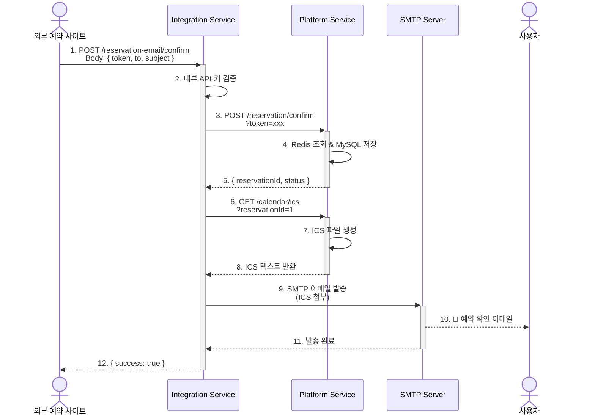

# 📧 Integration Service Documentation

**apps/integration** - 외부 서비스 통합 및 이메일 발송을 담당하는 서비스

---

## 📑 목차

1. [서비스 개요](#-서비스-개요)
2. [기술 스택](#-기술-스택)
3. [디렉토리 구조](#-디렉토리-구조)
4. [주요 모듈](#-주요-모듈)
5. [API 엔드포인트](#-api-엔드포인트)
6. [환경 변수](#-환경-변수)
7. [로컬 개발](#-로컬-개발)
8. [트러블슈팅](#-트러블슈팅)

---

## 🎯 서비스 개요

### 책임 범위

Integration 서비스는 **외부 서비스 통합 및 이메일 발송**을 담당하는 독립 서비스입니다.

**담당 도메인:**

- 📧 **예약 확인 이메일**: 예약 확정 시 ICS 파일 포함 이메일 자동 발송
- 🔗 **Platform 서비스 연동**: HTTP Client를 통한 내부 API 통신
- 🏗️ **Hexagonal Architecture**: Ports & Adapters 패턴으로 이메일 제공자 교체 가능

**외부 의존성:**

- Platform Service (내부 API)
- SMTP Server (Gmail, SendGrid 등)

**설계 철학:**

- **단일 책임**: 이메일 발송만 담당 (비즈니스 로직은 Platform이 처리)
- **느슨한 결합**: Port를 통해 이메일 제공자 교체 가능 (Nodemailer → SendGrid 등)
- **장애 격리**: 이메일 실패 시에도 Platform 서비스는 정상 작동

---

## 🛠️ 기술 스택

| 카테고리         | 기술                                                                                                                                                                                                                         |
| ---------------- | ---------------------------------------------------------------------------------------------------------------------------------------------------------------------------------------------------------------------------- |
| **Framework**    |                                                                                                                      |
| **Language**     |   |
| **Email**        |                                                                                                                                               |
| **HTTP Client**  |                                                                                                                              |
| **Architecture** | Hexagonal (Ports & Adapters)                                                                                                                                                                                                 |
| **Validation**   |                                                                                                                                      |

---

## 📁 디렉토리 구조

```plaintext
apps/integration/src/
├── reservation-email/              # 예약 이메일 모듈
│   ├── reservation-email.controller.ts  # API 엔드포인트
│   └── reservation-email.service.ts     # 비즈니스 로직
│
├── client/                         # 외부 서비스 클라이언트
│   └── platform-http.client.ts     # Platform API 호출
│
├── config/                         # 설정 파일
│   └── platform-http.config.ts     # Platform 연동 설정
│
├── adapters/                       # Ports & Adapters (Hexagonal)
│   └── nodemailer.adapter.ts       # Nodemailer 구현체
│
├── integration.module.ts           # 루트 모듈
├── integration.server.ts           # 서버 설정 (Swagger, Compression)
└── main.ts                         # 애플리케이션 진입점
```

---

## 🔧 주요 모듈

### 1. 예약 이메일 모듈 (reservation-email/)

#### 개요

예약 확정 후 사용자에게 ICS 파일이 포함된 이메일을 자동 발송합니다.

#### 주요 기능

- ✅ 예약 확정 이메일 발송 (ICS 파일 첨부)
- ✅ Platform 서비스와 HTTP 통신
- ✅ 내부 API 키 인증 (`x-internal-api-key`)

---

#### 예약 이메일 플로우



---

### 핵심 코드

**reservation-email.controller.ts**

```ts
import { Body, Controller, Post } from '@nestjs/common';
import { ApiSecurity, ApiTags } from '@nestjs/swagger';
import { ReservationEmailService } from './reservation-email.service';
import { SendReservationIcsOutDto } from '@libs/dao/integration/reservation-email/dto/send-reservation-ics-out.dto';
import { SendReservationIcsInDto } from '@libs/dao/integration/reservation-email/dto/send-reservation-ics-in.dto';
import { ResponseEntity } from '@libs/common/networks/response-entity';

@Controller('reservation-email')
@ApiSecurity('api-key')
@ApiTags('Reservation Email')
export class ReservationEmailController {
  constructor(
    private readonly reservationEmailService: ReservationEmailService,
  ) {}

  @Post('confirm')
  async confirmReservation(
    @Body() sendReservationIcsInDto: SendReservationIcsInDto,
  ): Promise<ResponseEntity<SendReservationIcsOutDto>> {
    const sendReservationIcsOutDto =
      await this.reservationEmailService.confirmReservation(
        sendReservationIcsInDto,
      );

    return ResponseEntity.ok().body(sendReservationIcsOutDto);
  }
}
```

**reservation-email.service.ts**

```ts
import { Inject, Injectable } from '@nestjs/common';
import { PlatformHttpClient } from '../client/platform-http.client';
import {
  EMAIL_SENDER,
  IEmailSender,
} from '@libs/common/ports/outbound/email-sender.port';
import { SendReservationIcsOutDto } from '@libs/dao/integration/reservation-email/dto/send-reservation-ics-out.dto';
import { SendReservationIcsInDto } from '@libs/dao/integration/reservation-email/dto/send-reservation-ics-in.dto';

@Injectable()
export class ReservationEmailService {
  constructor(
    private readonly platformHttpClient: PlatformHttpClient,

    @Inject(EMAIL_SENDER)
    private readonly emailSender: IEmailSender,
  ) {}

  /**
   * 예약 확정 후 ICS 메일 전송
   */
  async confirmReservation(
    sendReservationIcsInDto: SendReservationIcsInDto,
  ): Promise<SendReservationIcsOutDto> {
    const { token, to, subject } = sendReservationIcsInDto;

    // 1. Token 검증
    if (!token) {
      throw new Error('Token required');
    }

    // 2. Platform에 예약 확정 요청
    const { reservationId } =
      await this.platformHttpClient.confirmReservationByToken(token);

    if (!reservationId) {
      throw new Error('ReservationId not found');
    }

    // 3. Platform에서 ICS 파일 가져오기
    const icsText = await this.platformHttpClient.fetchIcsText(reservationId);

    // 4. 이메일 주소 검증
    if (!to) {
      throw new Error('to email required');
    }

    // 5. ICS 파일 포함 이메일 발송 (Port를 통한 의존성 주입)
    const mail = await this.emailSender.sendIcs(to, subject, icsText);

    return SendReservationIcsOutDto.of(mail);
  }
}
```

---

### 2. Platform HTTP Client (client/)

#### 개요

Platform 서비스와 HTTP 통신을 담당하는 클라이언트입니다.

#### 주요 기능

- ✅ 예약 확정 API 호출 (`POST /reservation/confirm`)
- ✅ ICS 파일 조회 API 호출 (`GET /calendar/ics`)
- ✅ 내부 API 키 인증 자동 추가

**platform-http.client.ts**

```ts
import { AbstractHttpService } from '@libs/common/networks/abstract-http-service';
import { Inject, Injectable } from '@nestjs/common';
import { HttpService } from '@nestjs/axios';
import { ConfigType } from '@nestjs/config';
import platformHttpConfig from '../config/platform-http.config';
import { ServerErrorException } from '@libs/common/exception/server-error.exception';
import { INTERNAL_ERROR_CODE } from '@libs/common/constants/internal-error-code.constants';

@Injectable()
export class PlatformHttpClient extends AbstractHttpService {
  constructor(
    protected readonly httpService: HttpService,
    @Inject(platformHttpConfig.KEY)
    config: ConfigType<typeof platformHttpConfig>,
  ) {
    super(httpService, config.baseUrl);
    this.headers = config.internalApiKey
      ? { 'x-internal-api-key': config.internalApiKey }
      : {};
  }

  /**
   * 예약 확정
   */
  async confirmReservationByToken(
    token: string,
  ): Promise<{ reservationId: number; status: string }> {
    try {
      return await this.post({
        method: 'reservation/confirm',
        data: { token },
      });
    } catch (e) {
      throw new ServerErrorException(
        INTERNAL_ERROR_CODE.EXTERNAL_PLATFORM_CONFIRM_FAILED,
      );
    }
  }

  /**
   * ICS 텍스트 가져오기
   */
  async fetchIcsText(reservationId: number): Promise<string> {
    try {
      const data = await this.get({
        method: 'calendar/ics',
        params: { reservationId },
      });
      return typeof data === 'string' ? data : data?.ics ?? '';
    } catch {
      throw new ServerErrorException(
        INTERNAL_ERROR_CODE.EXTERNAL_SERVICE_ERROR,
        'platform ics fetch failed',
      );
    }
  }
}
```

---

### 3. Hexagonal Architecture (Ports & Adapters)

#### 개요

이메일 제공자를 쉽게 교체할 수 있도록 **Port 인터페이스**를 정의합니다.

#### Port 인터페이스

```ts
// libs/common/ports/outbound/email-sender.port.ts
export const EMAIL_SENDER = 'EMAIL_SENDER';

export interface IEmailSender {
  sendIcs(to: string, subject: string, icsText: string): Promise<any>;
}
```

#### Adapter 구현체 (Nodemailer)

```ts
// apps/integration/src/adapters/nodemailer.adapter.ts
import { Injectable } from '@nestjs/common';
import { IEmailSender } from '@libs/common/ports/outbound/email-sender.port';
import * as nodemailer from 'nodemailer';

@Injectable()
export class NodemailerAdapter implements IEmailSender {
  private transporter;

  constructor() {
    this.transporter = nodemailer.createTransport({
      service: 'gmail',
      auth: {
        user: process.env.SMTP_USER,
        pass: process.env.SMTP_PASS,
      },
    });
  }

  async sendIcs(to: string, subject: string, icsText: string): Promise<any> {
    return await this.transporter.sendMail({
      from: process.env.SMTP_USER,
      to,
      subject,
      text: '예약이 확정되었습니다. 첨부된 ICS 파일을 캘린더에 추가하세요.',
      attachments: [
        {
          filename: 'reservation.ics',
          content: icsText,
          contentType: 'text/calendar',
        },
      ],
    });
  }
}
```

**장점:**

- ✅ **이메일 제공자 교체 가능**: Nodemailer → SendGrid → AWS SES
- ✅ **테스트 용이**: Mock 객체로 쉽게 단위 테스트
- ✅ **비즈니스 로직 분리**: Service는 Port에만 의존

---

## 📡 API 엔드포인트

### Swagger API 문서

| 메서드 | 경로        | 설명                            | 인증 |
| ------ | ----------- | ------------------------------- | ---- |
| GET    | `/api-docs` | Swagger UI (API 문서 및 테스트) | ❌   |

> **💡 Tip**: Swagger UI에서 모든 API를 시각적으로 테스트할 수 있습니다.  
> 브라우저에서 `http://localhost:${SERVER_PORT}/api-docs` 접속 후 우측 상단 **"Authorize"** 버튼으로 `x-internal-api-key`를 설정하세요.

---

### Integration 서비스 API 목록

### 예약 이메일 (reservation-email/)

| 메서드 | 경로                         | 설명                             | 인증                |
| ------ | ---------------------------- | -------------------------------- | ------------------- |
| POST   | `/reservation-email/confirm` | 예약 확인 이메일 발송 (ICS 첨부) | ✅ Internal API Key |

**요청 예시:**

```json
{
  "token": "abc123def456...",
  "to": "user@example.com",
  "subject": "골프장 예약이 확정되었습니다"
}
```

**응답 예시:**

```json
{
  "statusCode": 200,
  "body": {
    "success": true,
    "messageId": "<message-id@smtp.gmail.com>"
  }
}
```

---

## ⚙️ 환경 변수

### 환경 변수 파일 위치

Integration 서비스의 환경 변수는 **root의 `config/` 디렉토리**에서 관리됩니다.

```plaintext
project-root/
├── config/
│   ├── platform.env          # Platform 서비스 환경 변수
│   ├── integration.env        # ✅ Integration 서비스 환경 변수 (여기!)
│   └── llm-gateway.env        # LLM Gateway 서비스 환경 변수
```

---

### config/integration.env 설정 예시

```bash
# ===================================
# Integration 서비스 설정
# ===================================

# 서버 설정
NODE_ENV=development
SERVER_PORT=3001                # Integration 서비스 포트 (기본값: 3001)

# Platform 서비스 연동
PLATFORM_BASE_URL=http://localhost:3000  # Platform 서비스 URL (SERVER_PORT와 일치)
INTERNAL_API_KEY=your-internal-api-key   # Platform과 동일한 API 키

# SMTP 설정 (Gmail 예시)
SMTP_USER=your-email@gmail.com
SMTP_PASS=your-app-password     # Gmail 앱 비밀번호

# SMTP 설정 (SendGrid 예시)
# SMTP_HOST=smtp.sendgrid.net
# SMTP_PORT=587
# SMTP_USER=apikey
# SMTP_PASS=your-sendgrid-api-key
```

---

### 주요 환경 변수 설명

| 환경 변수           | 설명                        | 기본값                  | 필수 |
| ------------------- | --------------------------- | ----------------------- | ---- |
| `NODE_ENV`          | 실행 환경                   | `development`           | ✅   |
| `SERVER_PORT`       | Integration 서비스 포트     | `3001`                  | ✅   |
| `PLATFORM_BASE_URL` | Platform 서비스 URL         | `http://localhost:3000` | ✅   |
| `INTERNAL_API_KEY`  | 서비스 간 인증 키           | -                       | ✅   |
| `SMTP_USER`         | SMTP 사용자 이메일          | -                       | ✅   |
| `SMTP_PASS`         | SMTP 비밀번호 (앱 비밀번호) | -                       | ✅   |
| `SMTP_HOST`         | SMTP 서버 (SendGrid 등)     | -                       | ❌   |
| `SMTP_PORT`         | SMTP 포트                   | `587`                   | ❌   |

---

### 포트 번호 변경 방법

Integration 서비스의 포트를 변경하려면:

1. **`config/integration.env` 파일 수정**

   ```bash
   SERVER_PORT=3005  # 원하는 포트 번호로 변경
   ```

2. **Platform 서비스에서 Integration URL 업데이트 (필요 시)**

   - Platform이 Integration을 호출하는 경우, Platform의 환경 변수도 업데이트 필요

3. **서비스 재시작**

   ```bash
   pnpm run start:dev integration
   ```

4. **Swagger 접속**
   ```
   http://localhost:3005/api-docs  # 변경된 포트로 접속
   ```

---

## 🚀 로컬 개발

### 1. 환경 변수 설정

```bash
# 1. config 디렉토리로 이동
cd config

# 2. 예제 파일 복사
cp integration.env.example integration.env

# 3. integration.env 파일 수정
# - SERVER_PORT: Integration 서비스 포트 (기본값: 3001)
# - PLATFORM_BASE_URL: Platform 서비스 URL
# - INTERNAL_API_KEY: Platform과 동일한 키
# - SMTP_USER, SMTP_PASS: Gmail 또는 SendGrid 설정
```

---

### 2. Integration 실행

```bash
# 개발 모드 (Hot Reload)
pnpm run start:dev integration
# 👉 config/integration.env의 SERVER_PORT 사용

# 프로덕션 빌드
pnpm run build integration
pnpm run start:prod integration
```

**접속:**

- Integration: `http://localhost:${SERVER_PORT}/api-docs` (기본값: http://localhost:3001/api-docs)
- Health Check: `http://localhost:${SERVER_PORT}/health` (기본값: http://localhost:3001/health)

---

### 3. API 테스트

```bash
# Health Check (config/integration.env의 SERVER_PORT 사용)
curl http://localhost:${SERVER_PORT}/health

# 기본 포트 사용 시
curl http://localhost:3001/health

# 예약 확인 이메일 발송
curl -X POST http://localhost:${SERVER_PORT}/reservation-email/confirm \
  -H "x-internal-api-key: your-internal-api-key" \
  -H "Content-Type: application/json" \
  -d '{
    "token": "abc123def456...",
    "to": "user@example.com",
    "subject": "골프장 예약이 확정되었습니다"
  }'
```

---

## 📚 관련 문서

- [🏗️ 전체 아키텍처](../README.md)
- [📱 Platform 서비스](./platform.md)
- [🤖 LLM Gateway 서비스](./llm-gateway.md)
- [🗄️ 데이터베이스 설계](./database.md)
- [🔐 보안 전략](./security.md)

---

## 🐛 트러블슈팅

### 1. SMTP 인증 실패

```bash
Error: Invalid login: 535-5.7.8 Username and Password not accepted

# 해결:
1. Gmail 계정에서 "2단계 인증" 활성화
2. "앱 비밀번호" 생성
3. config/integration.env의 SMTP_PASS에 앱 비밀번호 입력
```

---

### 2. Platform 연결 오류

```bash
Error: connect ECONNREFUSED 127.0.0.1:3000

# 해결:
1. Platform 서비스가 실행 중인지 확인
pnpm run start:dev platform

2. config/integration.env의 PLATFORM_BASE_URL 확인
PLATFORM_BASE_URL=http://localhost:3000  # Platform의 SERVER_PORT와 일치

3. config/platform.env의 SERVER_PORT 확인
SERVER_PORT=3000  # PLATFORM_BASE_URL의 포트와 일치
```

---

### 3. 내부 API 키 오류

```bash
Error: 401 Unauthorized

# 해결:
1. Platform과 Integration의 INTERNAL_API_KEY가 동일한지 확인
   - config/platform.env의 INTERNAL_API_KEY
   - config/integration.env의 INTERNAL_API_KEY

2. 요청 헤더에 x-internal-api-key가 포함되어 있는지 확인
```

---

### 4. ICS 파일 다운로드는 되지만 캘린더 등록 실패 ⚠️

#### 증상

- `GET /calendar/ics?reservationId={id}` 호출 시 `.ics` 파일 다운로드 성공
- **Apple Calendar(맥 캘린더)에서 파일 열 때**: _"가져온 캘린더 파일을 읽을 수 없습니다."_ 오류
- **Google Calendar/Outlook**: 이벤트 등록 화면이 뜨지 않음

#### 재현 절차

1. Swagger에서 `GET /calendar/ics?reservationId=101` 실행
2. `reservation.ics` 파일 다운로드
3. macOS에서 `reservation.ics` 더블클릭 (Apple Calendar로 열기)
4. 오류 메시지 표시 → **이벤트 등록 화면이 뜨지 않음**

#### 기대 동작

- `.ics` 파일 더블클릭 시 캘린더 앱에서 **이벤트 추가 화면**이 즉시 표시되어야 함

#### 추정 원인

**A. 응답 포맷 문제**

```ts
// ❌ 잘못된 방식: JSON으로 래핑된 응답
{
  "statusCode": 200,
  "body": {
  "icsText": "BEGIN:VCALENDAR\nVERSION:2.0\n..."
}
}

// ✅ 올바른 방식: 순수 ICS 텍스트
BEGIN:VCALENDAR
VERSION:2.0
PRODID:-//Golf Reservation//NONSGML v1.0//EN
...
END:VCALENDAR
```

**B. HTTP 헤더 누락**

```ts
// 필수 헤더
Content-Type: text/calendar; charset=utf-8
Content-Disposition: attachment; filename="reservation.ics"
Content-Transfer-Encoding: binary
Cache-Control: no-cache
```

**C. iCalendar 스펙(RFC 5545) 부족**

- ❌ **개행 문제**: `\n` 사용 → ✅ `\r\n` (CRLF) 필수
- ❌ **시간대 누락**: `DTSTART:20240101T100000` → ✅ `DTSTART;TZID=Asia/Seoul:20240101T100000`
- ❌ **필수 필드 누락**: `ORGANIZER`, `LOCATION`, `VTIMEZONE` 블록

#### 해결 방법

**즉시 해결 - Platform 서비스의 Calendar Controller 수정**

```ts
import { Response } from 'express';

@Get('/ics')
async getIcs(
  @Query('reservationId', ParseIntPipe) reservationId: number,
@Res() res: Response,
): Promise<void> {
  const dto = await this.calendarService.createIcsByReservationId(reservationId);

  // 1. 헤더 설정
  res.setHeader('Content-Type', 'text/calendar; charset=utf-8');
  res.setHeader('Content-Disposition', 'attachment; filename="reservation.ics"');
  res.setHeader('Content-Transfer-Encoding', 'binary');
  res.setHeader('Cache-Control', 'no-cache');

  // 2. 순수 텍스트로 전송 (JSON 래핑 없음)
  res.send(dto.icsText);
}
```

**ICS 본문 스펙 보강 - Calendar Service**

```ts
private generateIcsText(reservation: Reservation): string {
  const { startTime, endTime, golfCourse, user } = reservation;

  // CRLF(\r\n) 개행 사용
  return [
    'BEGIN:VCALENDAR',
    'VERSION:2.0',
    'PRODID:-//Golf Reservation System//NONSGML v1.0//EN',
    'CALSCALE:GREGORIAN',
    'METHOD:PUBLISH',
    '',
    // VTIMEZONE 블록 (Apple Calendar 권장)
    'BEGIN:VTIMEZONE',
    'TZID:Asia/Seoul',
    'BEGIN:STANDARD',
    'DTSTART:19700101T000000',
    'TZOFFSETFROM:+0900',
    'TZOFFSETTO:+0900',
    'TZNAME:KST',
    'END:STANDARD',
    'END:VTIMEZONE',
    '',
    'BEGIN:VEVENT',
    `UID:${reservation.id}@golf-reservation.com`,
    `DTSTAMP:${this.formatDateToIcs(new Date())}`,  // UTC 시간
    `DTSTART;TZID=Asia/Seoul:${this.formatDateToIcs(startTime)}`,
    `DTEND;TZID=Asia/Seoul:${this.formatDateToIcs(endTime)}`,
    `SUMMARY:골프 예약 - ${golfCourse.name}`,
    `DESCRIPTION:예약자: ${user.name}\\n연락처: ${user.phone}`,
    `LOCATION:${golfCourse.address}`,
    `ORGANIZER;CN=${golfCourse.name}:mailto:noreply@golf-reservation.com`,
    'STATUS:CONFIRMED',
    'SEQUENCE:0',
    'END:VEVENT',
    'END:VCALENDAR',
  ].join('\r\n');  // CRLF 개행
}

private formatDateToIcs(date: Date): string {
  // YYYYMMDDTHHmmss 형식
  return date.toISOString().replace(/[-:]/g, '').split('.')[0];
}
```

#### 검증 체크리스트

- [ ] **헤더**: 네트워크 탭에서 `Content-Type: text/calendar` 확인
- [ ] **본문**: 파일 열어 `BEGIN:VCALENDAR`로 시작, JSON 래핑 없음
- [ ] **개행**: CRLF(`\r\n`) 적용 확인
- [ ] **시간 필드**: `DTSTART/DTEND`에 `TZID=Asia/Seoul` 포함
- [ ] **필수 필드**: `UID`, `DTSTAMP`, `SUMMARY`, `ORGANIZER`, `LOCATION`, `VTIMEZONE` 존재
- [ ] **Apple Calendar**: 더블클릭 → 추가 화면 표시
- [ ] **Google Calendar**: "가져오기"로 등록 가능
- [ ] **Outlook**: 드래그/가져오기로 등록 가능

#### 영향도

- 🔴 **높음**: 캘린더 연동의 핵심 가치 훼손 (다운로드만 되는 "반쪽 기능")
- 🔴 **포트폴리오/데모 신뢰도 저하**

#### 참고 자료

- [RFC 5545 - iCalendar Specification](https://datatracker.ietf.org/doc/html/rfc5545)
- [Apple Calendar iCalendar Support](https://support.apple.com/guide/calendar/import-or-export-calendars-icl1023/mac)
