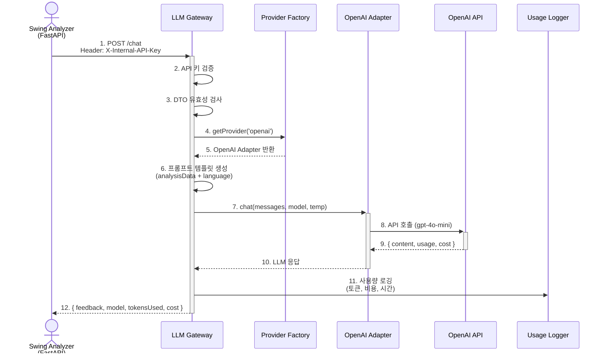

# 🤖 LLM Gateway Service Documentation

**apps/llm-gateway** - LLM API 중앙 관리 및 프록시 서비스

---

## 📑 목차

1. [서비스 개요](#-서비스-개요)
2. [기술 스택](#-기술-스택)
3. [디렉토리 구조](#-디렉토리-구조)
4. [주요 모듈](#-주요-모듈)
5. [API 엔드포인트](#-api-엔드포인트)
6. [환경 변수](#-환경-변수)
7. [로컬 개발](#-로컬-개발)
8. [트러블슈팅](#-트러블슈팅)

---

## 🎯 서비스 개요

### 책임 범위

LLM Gateway 서비스는 **여러 LLM API를 통합 관리**하는 중앙 프록시 서버입니다.

**담당 도메인:**

- 🤖 **LLM API 통합**: OpenAI, Claude 등 여러 제공자 통합
- 💰 **비용 최적화**: Redis 캐싱으로 동일 요청 비용 절감
- 📊 **사용량 추적**: 토큰 사용량 및 비용 로깅
- 🎯 **프롬프트 관리**: 템플릿 기반 프롬프트 생성

**외부 의존성:**

- OpenAI API
- Anthropic Claude API (선택)
- Redis (캐싱, 현재 주석 처리)

**설계 철학:**

- **단일 진입점**: 모든 LLM 요청이 이 서비스를 경유
- **제공자 추상화**: Adapter 패턴으로 LLM 제공자 쉽게 추가
- **비용 관리**: 사용량 로깅으로 비용 추적

---

## 🛠️ 기술 스택

| 카테고리         | 기술                                                                                                                                                                                                                         |
| ---------------- | ---------------------------------------------------------------------------------------------------------------------------------------------------------------------------------------------------------------------------- |
| **Framework**    |                                                                                                                      |
| **Language**     |   |
| **LLM APIs**     |                                                    |
| **Cache**        |  (현재 주석 처리)                                                                                                        |
| **Architecture** | Factory Pattern + Adapter Pattern                                                                                                                                                                                            |
| **Validation**   |                                                                                                                                      |

---

## 📁 디렉토리 구조

```plaintext
apps/llm-gateway/src/
├── chat/                           # 채팅 API 모듈
│   ├── chat.controller.ts          # API 엔드포인트
│   ├── chat.service.ts             # 비즈니스 로직
│   ├── dto/                        # 요청/응답 DTO
│   │   ├── chat-in.dto.ts          # 요청(Input) DTO
│   │   └── chat-out.dto.ts         # 응답(Output) DTO
│
├── providers/                      # LLM 제공자 어댑터
│   ├── provider.factory.ts         # Factory Pattern
│   ├── openai.adapter.ts           # OpenAI 구현체
│   └── claude.adapter.ts           # Claude 구현체
│
├── prompt/                         # 프롬프트 관리
│   └── prompt-template.service.ts  # 템플릿 기반 프롬프트 생성
│
├── cost/                           # 비용 추적
│   └── usage-logger.interceptor.ts # 사용량 로깅 인터셉터
│
├── cache/                          # 캐싱 (현재 주석 처리)
│   └── llm-cache.service.ts        # Redis 캐싱
│
├── llm-gateway.module.ts           # 루트 모듈
├── llm-gateway.server.ts           # 서버 설정 (Swagger, CORS)
└── main.ts                         # 애플리케이션 진입점
```

---

## 🔧 주요 모듈

### 1. Chat 모듈 (chat/)

#### 개요

LLM API 호출을 처리하는 핵심 모듈입니다.

#### 주요 기능

- ✅ 여러 LLM 제공자 지원 (OpenAI, Claude)
- ✅ 프롬프트 템플릿 기반 요청 생성
- ✅ 사용량 및 비용 로깅
- ✅ Redis 캐싱 (현재 비활성화)

---

#### LLM 호출 플로우



---

### 핵심 코드

**chat.controller.ts**

```ts
import {
  Controller,
  Post,
  Body,
  UseInterceptors,
  HttpCode,
  HttpStatus,
} from '@nestjs/common';
import { ApiTags, ApiOperation, ApiHeader } from '@nestjs/swagger';
import { ChatService } from './chat.service';
import { ChatOutDto } from './dto/chat-out.dto';
import { ChatInDto } from './dto/chat-in.dto';
import { UsageLoggerInterceptor } from '../cost/usage-logger.interceptor';
import { ApiKeyAuth } from '@libs/common/decorators/api-key-auth.decorator';

@ApiTags('LLM Gateway')
@Controller()
@ApiKeyAuth()
@UseInterceptors(UsageLoggerInterceptor) // 사용량 로깅
export class ChatController {
  constructor(private readonly chatService: ChatService) {}

  /**
   * LLM 채팅 요청을 처리하는 메인 엔드포인트
   */
  @Post('chat')
  @HttpCode(HttpStatus.OK)
  @ApiOperation({ summary: 'LLM 채팅 요청 (내부 전용)' })
  @ApiHeader({
    name: 'X-Internal-API-Key',
    description: '내부 서비스 인증 키',
    required: true,
  })
  async chat(@Body() chatOutDto: ChatOutDto): Promise<ChatInDto> {
    return await this.chatService.processChat(chatOutDto);
  }
}
```

**chat.service.ts (핵심 로직)**

```ts
import { Injectable, Logger, BadRequestException } from '@nestjs/common';
import { ProviderFactory } from '../providers/provider.factory';
import {
  PromptTemplateService,
  SwingAnalysisData,
} from '../prompt/prompt-template.service';
import { ChatOutDto } from './dto/chat-out.dto';
import { ChatInDto } from './dto/chat-in.dto';
import { LLMProviderPort } from '@libs/common/ports/outbound/llm-provider.port';

@Injectable()
export class ChatService {
  private readonly logger = new Logger(ChatService.name);

  constructor(
    private readonly providerFactory: ProviderFactory,
    private readonly promptTemplate: PromptTemplateService,
  ) {}

  async processChat(chatOutDto: ChatOutDto): Promise<ChatInDto> {
    const providerName = chatOutDto.provider || 'openai';

    this.logger.log(
      `LLM 요청 수신: Provider=${providerName}, Language=${
        chatOutDto.language || 'ko'
      }`,
    );

    // 1. 프로바이더(어댑터) 가져오기
    let llmProvider: LLMProviderPort;
    try {
      llmProvider = this.providerFactory.getProvider(providerName);
    } catch (factoryError) {
      this.logger.warn(`프로바이더 선택 실패: ${factoryError.message}`);
      throw new BadRequestException(factoryError.message);
    }

    // 2. 프롬프트 생성
    const prompt = this.promptTemplate.buildSwingAnalysisPrompt(
      chatOutDto.analysisData as SwingAnalysisData,
      chatOutDto.language || 'ko',
    );

    // 3. LLM 호출
    const llmResponse = await llmProvider.chat({
      messages: [
        { role: 'system', content: prompt },
        {
          role: 'user',
          content: '분석 결과를 바탕으로 피드백을 제공해주세요.',
        },
      ],
      model: chatOutDto.model,
      temperature: chatOutDto.temperature ?? 0.7,
      maxTokens: 2000,
      language: chatOutDto.language,
    });

    // 4. 최종 응답 DTO 구성
    const chatInDto: ChatInDto = {
      feedback: llmResponse.content,
      model: llmResponse.model,
      tokensUsed: llmResponse.tokensUsed,
      cost: llmResponse.cost,
      cached: false,
    };

    this.logger.log(
      `LLM 응답 완료 (${providerName}): 토큰=${
        llmResponse.tokensUsed.total
      }, 비용=$${llmResponse.cost?.toFixed(6)}`,
    );

    return chatInDto;
  }
}
```

---

### 2. Provider Factory & Adapters (providers/)

#### 개요

Factory 패턴으로 여러 LLM 제공자를 동적으로 선택합니다.

#### 지원 제공자

- ✅ **OpenAI** (기본값: gpt-4o-mini)
- ✅ **Claude** (anthropic/claude-3-5-sonnet-20241022)

**provider.factory.ts**

```ts
import { Injectable } from '@nestjs/common';
import { LLMProviderPort } from '@libs/common/ports/outbound/llm-provider.port';
import { OpenAIAdapter } from './openai.adapter';
import { ClaudeAdapter } from './claude.adapter';

@Injectable()
export class ProviderFactory {
  constructor(
    private readonly openaiAdapter: OpenAIAdapter,
    private readonly claudeAdapter: ClaudeAdapter,
  ) {}

  /**
   * 프로바이더 이름으로 어댑터 인스턴스 반환
   */
  getProvider(providerName: string): LLMProviderPort {
    switch (providerName.toLowerCase()) {
      case 'openai':
        return this.openaiAdapter;
      case 'claude':
        return this.claudeAdapter;
      default:
        throw new Error(`지원하지 않는 LLM 제공자: ${providerName}`);
    }
  }
}
```

**openai.adapter.ts (핵심 부분)**

```ts
import {
  Injectable,
  InternalServerErrorException,
  Logger,
} from '@nestjs/common';
import {
  LLMProviderPort,
  LLMRequest,
  LLMResponse,
} from '@libs/common/ports/outbound/llm-provider.port';
import OpenAI from 'openai';
import { ConfigService } from '@nestjs/config';

@Injectable()
export class OpenAIAdapter implements LLMProviderPort {
  readonly providerName = 'openai';
  private readonly logger = new Logger(OpenAIAdapter.name);
  private client: OpenAI;

  constructor(private configService: ConfigService) {
    const apiKey = this.configService.get<string>('LLM_OPENAI_API_KEY');

    if (!apiKey) {
      throw new Error('OpenAI API 키가 설정되지 않았습니다');
    }

    this.client = new OpenAI({ apiKey });
  }

  async chat(request: LLMRequest): Promise<LLMResponse> {
    const startTime = Date.now();
    const model = request.model || 'gpt-4o-mini';

    try {
      const completion = await this.client.chat.completions.create({
        model: model,
        messages: request.messages,
        temperature: request.temperature ?? 0.7,
        max_tokens: request.maxTokens,
      });

      const response = completion.choices[0].message;
      const usage = completion.usage;

      if (!response || !usage) {
        throw new InternalServerErrorException('OpenAI 응답이 비정상입니다.');
      }

      // 비용 계산 (gpt-4o-mini 기준: $0.15/1M input, $0.60/1M output)
      const cost =
        (usage.prompt_tokens * 0.15) / 1_000_000 +
        (usage.completion_tokens * 0.6) / 1_000_000;

      this.logger.log(
        `OpenAI (${model}) 요청 완료: ${Date.now() - startTime}ms, ` +
          `토큰: ${usage.total_tokens}, 비용: $${cost.toFixed(6)}`,
      );

      return {
        content: response.content || '',
        model: completion.model,
        tokensUsed: {
          prompt: usage.prompt_tokens,
          completion: usage.completion_tokens,
          total: usage.total_tokens,
        },
        cost,
      };
    } catch (error) {
      this.logger.error(`OpenAI API 호출 실패: ${error.message}`, error.stack);
      throw new InternalServerErrorException(
        `OpenAI API 호출 실패: ${error.message}`,
      );
    }
  }
}
```

---

### 3. 프롬프트 템플릿 (prompt/)

#### 개요

스윙 분석 데이터를 LLM 프롬프트로 변환합니다.

**prompt-template.service.ts (예시)**

```ts
import { Injectable } from '@nestjs/common';

export interface SwingAnalysisData {
  backswingAngle: number;
  downswingAngle: number;
  impact: {
    clubFaceAngle: number;
    clubPath: string;
  };
  // ... 기타 분석 데이터
}

@Injectable()
export class PromptTemplateService {
  /**
   * 스윙 분석 프롬프트 생성
   */
  buildSwingAnalysisPrompt(
    data: SwingAnalysisData,
    language: string = 'ko',
  ): string {
    const langInstruction =
      language === 'ko'
        ? '한국어로 답변해주세요.'
        : 'Please respond in English.';

    return `
당신은 골프 스윙 분석 전문가입니다. ${langInstruction}

다음 분석 데이터를 바탕으로 개선 피드백을 제공해주세요:

- 백스윙 각도: ${data.backswingAngle}도
- 다운스윙 각도: ${data.downswingAngle}도
- 임팩트 시 클럽 페이스 각도: ${data.impact.clubFaceAngle}도
- 클럽 경로: ${data.impact.clubPath}

**피드백 형식:**
1. 주요 문제점 (1-2가지)
2. 개선 방법 (구체적인 동작)
3. 추천 연습 방법
`.trim();
  }
}
```

---

### 4. 사용량 로깅 (cost/)

#### 개요

모든 LLM 요청의 토큰 사용량과 비용을 로깅합니다.

**usage-logger.interceptor.ts**

```ts
import {
  Injectable,
  NestInterceptor,
  ExecutionContext,
  CallHandler,
  Logger,
} from '@nestjs/common';
import { Observable } from 'rxjs';
import { tap } from 'rxjs/operators';

@Injectable()
export class UsageLoggerInterceptor implements NestInterceptor {
  private readonly logger = new Logger(UsageLoggerInterceptor.name);

  intercept(context: ExecutionContext, next: CallHandler): Observable<any> {
    const request = context.switchToHttp().getRequest();
    const startTime = Date.now();

    return next.handle().pipe(
      tap((response) => {
        const duration = Date.now() - startTime;

        // 응답에서 비용 정보 추출
        const { model, tokensUsed, cost } = response;

        this.logger.log(
          `📊 LLM 사용량: 모델=${model}, ` +
            `토큰=${tokensUsed?.total || 0}, ` +
            `비용=$${cost?.toFixed(6) || 0}, ` +
            `응답시간=${duration}ms`,
        );
      }),
    );
  }
}
```

---

## 📡 API 엔드포인트

### Swagger API 문서

| 메서드 | 경로        | 설명                            | 인증 |
| ------ | ----------- | ------------------------------- | ---- |
| GET    | `/api-docs` | Swagger UI (API 문서 및 테스트) | ❌   |

> **💡 Tip**: Swagger UI에서 모든 API를 시각적으로 테스트할 수 있습니다.  
> 브라우저에서 `http://localhost:${LLM_GATEWAY_SERVER_PORT}/api-docs` 접속 후 우측 상단 **"Authorize"** 버튼으로 `X-Internal-API-Key`를 설정하세요.

---

### LLM Gateway 서비스 API 목록

### 채팅 (chat/)

| 메서드 | 경로    | 설명                      | 인증                |
| ------ | ------- | ------------------------- | ------------------- |
| POST   | `/chat` | LLM 채팅 요청 (내부 전용) | ✅ Internal API Key |

**요청 예시:**

```json
{
  "provider": "openai",
  "model": "gpt-4o-mini",
  "temperature": 0.7,
  "language": "ko",
  "analysisData": {
    "backswingAngle": 95,
    "downswingAngle": 85,
    "impact": {
      "clubFaceAngle": 2,
      "clubPath": "inside-out"
    }
  }
}
```

**응답 예시:**

```json
{
  "feedback": "백스윙 시 팔이 너무 구부러져 있습니다...",
  "model": "gpt-4o-mini-2024-07-18",
  "tokensUsed": {
    "prompt": 150,
    "completion": 200,
    "total": 350
  },
  "cost": 0.000135,
  "cached": false
}
```

---

## ⚙️ 환경 변수

### 환경 변수 파일 위치

LLM Gateway 서비스의 환경 변수는 **root의 `config/` 디렉토리**에서 관리됩니다.

```plaintext
project-root/
├── config/
│   ├── platform.env          # Platform 서비스 환경 변수
│   ├── integration.env        # Integration 서비스 환경 변수
│   └── llm-gateway.env        # ✅ LLM Gateway 서비스 환경 변수 (여기!)
```

---

### config/llm-gateway.env 설정 예시

```bash
# ===================================
# LLM Gateway 서비스 설정
# ===================================

# 서버 설정
NODE_ENV=development
LLM_GATEWAY_SERVER_PORT=3002    # LLM Gateway 서비스 포트 (기본값: 3002)

# 내부 API 인증
INTERNAL_API_KEY=your-internal-api-key  # Swing Analyzer와 동일한 API 키

# OpenAI API
LLM_OPENAI_API_KEY=sk-proj-...  # OpenAI API 키

# Anthropic Claude API (선택)
LLM_CLAUDE_API_KEY=sk-ant-...   # Claude API 키 (선택 사항)

# Redis (캐싱, 현재 비활성화)
# REDIS_HOST=localhost
# REDIS_PORT=6379
```

---

### 주요 환경 변수 설명

| 환경 변수                 | 설명                    | 기본값        | 필수 |
| ------------------------- | ----------------------- | ------------- | ---- |
| `NODE_ENV`                | 실행 환경               | `development` | ✅   |
| `LLM_GATEWAY_SERVER_PORT` | LLM Gateway 서비스 포트 | `3002`        | ✅   |
| `INTERNAL_API_KEY`        | 서비스 간 인증 키       | -             | ✅   |
| `LLM_OPENAI_API_KEY`      | OpenAI API 키           | -             | ✅   |
| `LLM_CLAUDE_API_KEY`      | Claude API 키           | -             | ❌   |
| `REDIS_HOST`              | Redis 서버 호스트       | `localhost`   | ❌   |
| `REDIS_PORT`              | Redis 서버 포트         | `6379`        | ❌   |

---

### 포트 번호 변경 방법

LLM Gateway 서비스의 포트를 변경하려면:

1. **`config/llm-gateway.env` 파일 수정**

   ```bash
   LLM_GATEWAY_SERVER_PORT=3005  # 원하는 포트 번호로 변경
   ```

2. **Swing Analyzer(FastAPI)에서 LLM Gateway URL 업데이트 (필요 시)**

   - Swing Analyzer가 LLM Gateway를 호출하는 경우, URL 업데이트 필요

3. **서비스 재시작**

   ```bash
   pnpm run start:dev llm-gateway
   ```

4. **Swagger 접속**
   ```
   http://localhost:3005/api-docs  # 변경된 포트로 접속
   ```

---

## 🚀 로컬 개발

### 1. 환경 변수 설정

```bash
# 1. config 디렉토리로 이동
cd config

# 2. 예제 파일 복사
cp llm-gateway.env.example llm-gateway.env

# 3. llm-gateway.env 파일 수정
# - LLM_GATEWAY_SERVER_PORT: LLM Gateway 서비스 포트 (기본값: 3002)
# - INTERNAL_API_KEY: Swing Analyzer와 동일한 키
# - LLM_OPENAI_API_KEY: OpenAI API 키 (필수)
# - LLM_CLAUDE_API_KEY: Claude API 키 (선택)
```

---

### 2. LLM Gateway 실행

```bash
# 개발 모드 (Hot Reload)
pnpm run start:dev llm-gateway
# 👉 config/llm-gateway.env의 LLM_GATEWAY_SERVER_PORT 사용

# 프로덕션 빌드
pnpm run build llm-gateway
pnpm run start:prod llm-gateway
```

**접속:**

- LLM Gateway: `http://localhost:${LLM_GATEWAY_SERVER_PORT}/api-docs` (기본값: http://localhost:3002/api-docs)
- Health Check: `http://localhost:${LLM_GATEWAY_SERVER_PORT}/health` (기본값: http://localhost:3002/health)

---

### 3. API 테스트

```bash
# Health Check (config/llm-gateway.env의 LLM_GATEWAY_SERVER_PORT 사용)
curl http://localhost:${LLM_GATEWAY_SERVER_PORT}/health

# 기본 포트 사용 시
curl http://localhost:3002/health

# LLM 채팅 요청
curl -X POST http://localhost:${LLM_GATEWAY_SERVER_PORT}/chat \
  -H "X-Internal-API-Key: your-internal-api-key" \
  -H "Content-Type: application/json" \
  -d '{
    "provider": "openai",
    "model": "gpt-4o-mini",
    "temperature": 0.7,
    "language": "ko",
    "analysisData": {
      "backswingAngle": 95,
      "downswingAngle": 85,
      "impact": {
        "clubFaceAngle": 2,
        "clubPath": "inside-out"
      }
    }
  }'
```

---

## 📚 관련 문서

- [🏗️ 전체 아키텍처](../README.md)
- [📱 Platform 서비스](./platform.md)
- [📧 Integration 서비스](./integration.md)
- [🗄️ 데이터베이스 설계](./database.md)
- [🔐 보안 전략](./security.md)

---

## 🐛 트러블슈팅

### 1. OpenAI API 키 오류

```bash
Error: OpenAI API 키가 설정되지 않았습니다

# 해결:
1. config/llm-gateway.env 파일에 LLM_OPENAI_API_KEY 추가
LLM_OPENAI_API_KEY=sk-proj-...

2. OpenAI 대시보드에서 API 키 확인
https://platform.openai.com/api-keys
```

---

### 2. 내부 API 키 오류

```bash
Error: 401 Unauthorized

# 해결:
1. 요청 헤더에 X-Internal-API-Key 포함 확인
2. Swing Analyzer(FastAPI)의 INTERNAL_API_KEY가 일치하는지 확인
   - config/llm-gateway.env의 INTERNAL_API_KEY
   - Swing Analyzer(FastAPI)의 INTERNAL_API_KEY
```

---

### 3. 비용 과다 발생

```bash
Warning: OpenAI API 비용이 예상보다 높습니다

# 해결:
1. Redis 캐싱 활성화 (chat.service.ts 주석 제거)
   - config/llm-gateway.env에 REDIS_HOST, REDIS_PORT 추가

2. 모델을 gpt-4o-mini로 변경 (비용 1/10)
   - 요청 시 model 파라미터 변경

3. temperature 값을 낮춰서 토큰 사용량 감소
   - temperature: 0.3 ~ 0.5 권장
```

---

### 4. Swing Analyzer 연결 오류

```bash
Error: connect ECONNREFUSED

# 해결:
1. LLM Gateway 서비스가 실행 중인지 확인
pnpm run start:dev llm-gateway

2. config/llm-gateway.env의 LLM_GATEWAY_SERVER_PORT 확인
LLM_GATEWAY_SERVER_PORT=3002

3. Swing Analyzer(FastAPI)의 LLM Gateway URL 확인
LLM_GATEWAY_URL=http://localhost:3002  # LLM_GATEWAY_SERVER_PORT와 일치
```
