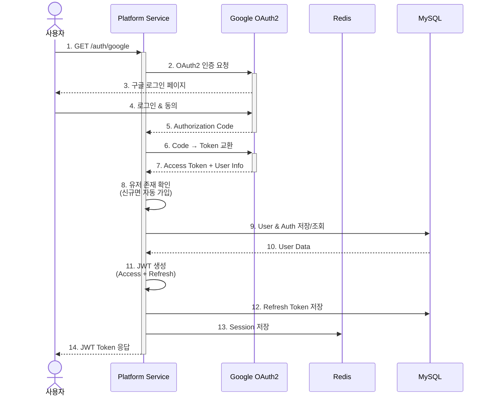
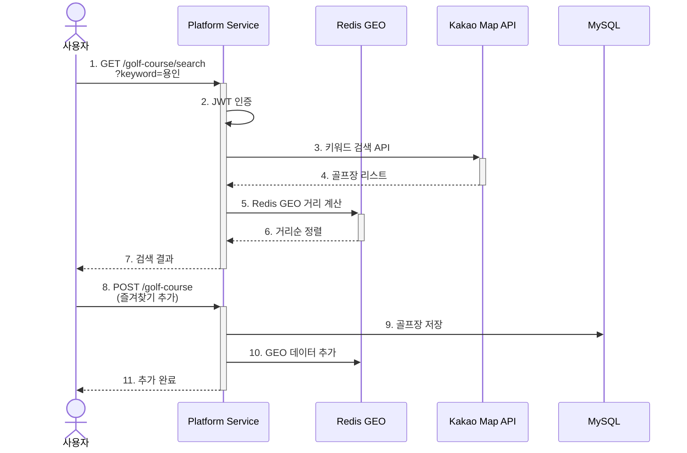
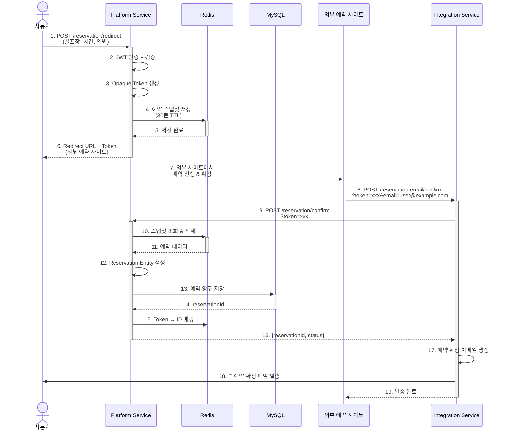
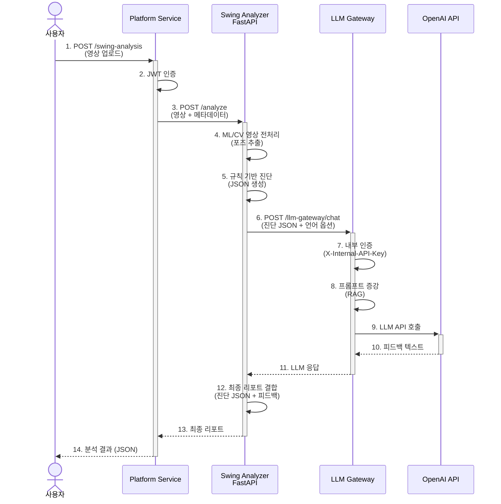

# 📱 Platform Service Documentation

**apps/platform** - 골프장 탐색, 인증, 예약 관리를 담당하는 메인 서비스

---

## 📑 목차

1. [서비스 개요](#-서비스-개요)
2. [기술 스택](#-기술-스택)
3. [디렉토리 구조](#-디렉토리-구조)
4. [주요 모듈](#-주요-모듈)
5. [API 엔드포인트](#-api-엔드포인트)
6. [환경 변수](#-환경-변수)
7. [로컬 개발](#-로컬-개발)

---

## 🎯 서비스 개요

### 책임 범위

Platform 서비스는 **핵심 비즈니스 로직**을 담당하는 메인 애플리케이션입니다.

**담당 도메인:**

- 🔐 **인증 (auth)**: Google OAuth2 기반 로그인, JWT 토큰 관리
- 🗺️ **골프장 검색 (golf-course)**: Kakao API + Redis GEO 기반 위치 검색
- 📅 **예약 관리 (reservation)**: 외부 예약 사이트 리다이렉트, 예약 확정
- 📆 **캘린더 (calendar)**: 예약 일정 관리, ICS 파일 생성
- 🏌️ **스윙 분석 (swing-analysis)**: 영상 업로드 중계 (외부 FastAPI 서비스 호출)
- 👤 **사용자 관리 (users)**: 프로필, 즐겨찾기
- ⭐ **즐겨찾기 (favorite)**: 골프장 즐겨찾기 관리

**외부 의존성:**

- Google OAuth2 (인증)
- Kakao Map API (골프장 검색)
- Redis (GEO 검색, 세션 관리)
- MySQL (메인 데이터베이스)
- Swing Analyzer (FastAPI 외부 서비스)

---

## 🛠️ 기술 스택

| 카테고리          | 기술                                                                                                                                                                                                                         |
| ----------------- | ---------------------------------------------------------------------------------------------------------------------------------------------------------------------------------------------------------------------------- |
| **Framework**     |                                                                                                                      |
| **Language**      |   |
| **ORM**           |                                                                                                                  |
| **Database**      |                                                                                                                          |
| **Cache**         |                                                                                                                          |
| **Auth**          |        |
| **Validation**    |                                          |
| **External APIs** |                                                                                                                      |
| **Reservation**   |  (네이버/카카오 API 제휴 필요로 외부 사이트 리다이렉트 방식)                                                                             |

---

## 📁 디렉토리 구조

```plainText
apps/platform/src/
├── auth/                           # 인증 모듈
│   ├── auth.controller.ts          # 인증 API 엔드포인트
│   ├── auth.service.ts             # 인증 비즈니스 로직
│   └── google/                     # Google OAuth2 전략
│       ├── oauth-google.service.ts
│       └── google.strategy.ts
│
├── golf-course/                    # 골프장 검색 모듈
│   ├── golf-course.controller.ts   # 검색 API
│   └── golf-course.service.ts      # Kakao API + Redis GEO
│
├── reservation/                    # 예약 관리 모듈
│   ├── reservation.controller.ts   # 예약 API
│   └── reservation.service.ts      # 예약 로직 (Opaque Token)
│
├── calendar/                       # 캘린더 모듈
│   ├── calendar.controller.ts      # ICS 파일 생성 API
│   └── calendar.service.ts         # iCal 포맷 생성
│
├── swing-analysis/                 # 스윙 분석 모듈
│   ├── swing-analysis.controller.ts # 영상 업로드 API
│   └── swing-analysis.service.ts    # FastAPI 중계
│
├── users/                          # 사용자 관리 모듈
│   ├── users.controller.ts
│   └── users.service.ts
│
├── favorite/                       # 즐겨찾기 모듈
│   ├── favorite.controller.ts
│   └── favorite.service.ts
│
├── config/                         # 설정 파일
│   ├── database.config.ts
│   └── redis.config.ts
│
├── platform.module.ts              # 루트 모듈
├── main.ts                         # 애플리케이션 진입점
└── platform.server.ts              # 서버 설정
```

---

## 🔧 주요 모듈

### 1. 인증 모듈 (auth/)

#### 개요

Google OAuth2 기반 소셜 로그인과 JWT 토큰 관리를 담당합니다.

#### 주요 기능

- ✅ Google OAuth2 로그인
- ✅ JWT Access Token + Refresh Token 발급
- ✅ 자동 회원가입 (신규 유저)
- ✅ Refresh Token 갱신
- ✅ 로그아웃

---

#### 인증 플로우



---

### 핵심 코드

**auth.service.ts - Google 로그인**

```ts
async googleLogin(code: string): Promise<OAuthTokenDto> {
  // 1. Google에서 토큰 받아오기
  const getPlatformTokenOutDto = await this.oauthGoogleService.getPlatformToken(code);

  // 2. 토큰으로 유저 정보 조회
  const oAuthGoogleInfo = await this.oauthGoogleService.verifyPlatformToken(
    getPlatformTokenOutDto.platformToken
  );

  // 3. DB에서 유저 확인 (없으면 자동 생성)
  let auth = await this.authRepository.findByEmail(oAuthGoogleInfo.email);
  let user: User;

if (!auth) {
  user = User.create({
    nickname: this._generateNickname() // "Member_abc12"
  });
  await this.usersRepository.insert(user);

  auth = Auth.create({
    userId: user.id,
    email: oAuthGoogleInfo.email,
    authType: AUTH_TYPE.GOOGLE,
    providerId: oAuthGoogleInfo.providerId,
  });
  await this.authRepository.insert(auth);
} else {
  user = await this.usersRepository.findById(auth.userId);
}

// 4. JWT 생성
const { accessToken, refreshToken } = await this._generateToken({
  userId: user.id,
  email: auth.email,
});

// 5. Refresh Token 저장 (AES-256 암호화)
await this.authRepository.updateById(user.id, { refreshToken });

// 6. Redis 세션 저장 (즐겨찾기 캐시 동기화)
await this.cacheSyncProvider.syncCacheByCondition(user.id);

return OAuthTokenDto.of({
  userId: user.id,
  email: auth.email,
  name: user.name ?? null,
  accessToken,
});
}

```

**JWT 생성**

```ts
private async _generateToken(authPayload: AuthPayload): Promise<Record<string, string>> {
  return {
    // Access Token: 15분 유효
    accessToken: TokenUtil.generateAccessToken(authPayload.userId),

    // Refresh Token: 7일 유효
    refreshToken: TokenUtil.generateRefreshToken(),
  };
}

```

**Refresh Token 갱신**

```ts
async refreshAccessToken(refreshAccessTokenInDto: RefreshAccessTokenInDto): Promise<OAuthVerifyOutDto> {
  const { accessToken, refreshToken } = refreshAccessTokenInDto;

  // 1. Access Token 디코딩 (만료되어도 userId 추출 가능)
  const { userId } = this._decodeAccessToken(accessToken);

  // 2. DB에서 Refresh Token 확인
  const auth = await this.authRepository.findByUserId(userId);

  if (!auth) {
  throw new ServerErrorException(INTERNAL_ERROR_CODE.USER_NOT_FOUND);
}

if (auth.refreshToken !== refreshToken) {
  throw new ServerErrorException(INTERNAL_ERROR_CODE.LOGIN_REFRESH_TOKEN_INVALIDATE);
}

// 3. Refresh Token TTL 확인
const ttl = this._decodeRefreshToken(refreshToken);
const now = new Date().getTime();

if (ttl < now) {
  throw new ServerErrorException(INTERNAL_ERROR_CODE.LOGIN_REFRESH_TOKEN_EXPIRED);
}

// 4. TTL 만료 임박 시 Refresh Token도 갱신
if (ttl - REFRESH_TOKEN_UPDATE_TTL < now) {
  auth.refreshToken = TokenUtil.generateRefreshToken();
  await this.authRepository.updateById(userId, auth);
}

// 5. 새 Access Token 발급
return OAuthVerifyOutDto.of({
  accessToken: TokenUtil.generateAccessToken(userId),
  refreshToken: auth.refreshToken,
});
}

```

---

### 2. 골프장 검색 모듈 (golf-course/)

### 개요

Kakao Map API와 Redis GEO를 활용한 위치 기반 골프장 검색 서비스입니다.

### 주요 기능

- ✅ 키워드 검색 (Kakao API)
- ✅ 위치 기반 근처 검색 (Redis GEO)
- ✅ 즐겨찾기 추가/삭제
- ✅ 즐겨찾기 목록 조회 (Redis 캐싱)

---

### 골프장 검색 플로우



---

### 핵심 코드

**golf-course.service.ts - 키워드 검색**

```ts
async findByKeyword(searchPlaceInDto: SearchPlaceInDto): Promise<SearchOutDto> {
  const { keyword, page, size } = searchPlaceInDto;

  // Kakao Local API 호출
  const response = await this.kakaoProvider.get({
    method: 'keyword.json',
    params: {
      query: keyword,
      page,
      size,
    },
  });

  return SearchOutDto.of({
    totalCount: response.meta.total_count,
    isEnd: response.meta.is_end,
    documents: response.documents,
  });
}

```

**위치 기반 근처 검색 (Redis GEO)**

```ts
async findNearByPlace(searchNearByInDto: SearchNearByInDto): Promise<SearchOutDto> {
  const { lng, lat, radius, category, page, size } = searchNearByInDto;

  // Kakao API로 골프장 검색
  const response = await this.kakaoProvider.get({
    method: 'category.json',
    params: {
      category_group_code: KAKAO_CATEGORY_CODE[category], // 'GOLF_COURSE'
      x: lng,
      y: lat,
      radius: radius, // 5000m (5km)
      page,
      size,
    },
  });

  return SearchOutDto.of({
    totalCount: response.meta.total_count,
    isEnd: response.meta.is_end,
    documents: response.documents,
  });
}

```

**즐겨찾기 추가**

```ts
async addGolfCourse(userId: number, addGolfCourseInDto: AddGolfCourseInDto): Promise<GolfCourseOutDto> {
  const { golfCourseName, lng, lat } = addGolfCourseInDto;

  // 1. 중복 확인
  const isExisted = await this.golfCourseRepository.findByUserIdAndCoordinates(
    userId,
    golfCourseName,
    lng,
    lat,
  );

  if (isExisted) {
    throw new ServerErrorException(INTERNAL_ERROR_CODE.GOLF_COURSE_ALREADY_CREATED);
  }

  // 2. MySQL 저장
  const golfCourse = GolfCourse.create({ userId, ...addGolfCourseInDto });
  await this.golfCourseRepository.insert(golfCourse);

  return GolfCourseOutDto.of(golfCourse);
}

async getGolfCourse(userId: number): Promise<GolfCourseOutDto[]> {
  const golfCourses = await this.golfCourseRepository.findByUserIdIn(userId);
  return GolfCourseOutDto.fromEntities(golfCourses);
}

async deleteGolfCourse(userId: number, id: number): Promise<void> {
  const listGolfCourse = await this.golfCourseRepository.findByUserIdIn(userId);

  const isExist = listGolfCourse.map((it) => it.id).includes(id);

  if (!isExist) {
  throw new ServerErrorException(INTERNAL_ERROR_CODE.GOLF_COURSE_NOT_FOUND);
}

await this.golfCourseRepository.deleteById(id);
}

```

---

### Redis GEO 명령어

**데이터 추가:**

```bash
GEOADD golf-courses 127.0276 37.4979 "1"  # 강남 골프장
GEOADD golf-courses 126.9780 37.5665 "2"  # 서울 골프장
```

**반경 검색 (5km):**

```bash
GEORADIUS golf-courses 127.0 37.5 5 km WITHDIST ASC

# 응답:
# 1) "1"
#    "4.2km"
# 2) "2"
#    "4.8km"
```

---

### 3. 예약 관리 모듈 (reservation/)

### 개요

골프장 예약을 외부 예약 사이트로 리다이렉트하고, 예약 확정 후 이메일 발송을 처리합니다.

**⚠️ 설계 변경 사항:**

- **기존 계획**: 네이버/카카오 예약 API 직접 연동
- **변경 이유**: 예약 API 사용 시 제휴 계약 필요, 개인 프로젝트로 불가능
- **현재 방식**: 외부 골프장 예약 사이트로 리다이렉트 → 예약 확정 시 웹훅으로 이메일 발송

### 주요 기능

- ✅ 예약 리다이렉트 토큰 생성 (Redis 스냅샷)
- ✅ 외부 예약 사이트로 리다이렉트
- ✅ 예약 확정 (Redis → MySQL 이동)
- ✅ Integration 서비스로 이메일 발송 요청
- ✅ 예약 히스토리 조회
- ✅ 예약 취소

---

### 예약 플로우



---

### 핵심 코드

**reservation.service.ts - 리다이렉트 토큰 생성**

```ts
async createRedirectToken(createRedirectTokenInDto: CreateRedirectTokenInDto): Promise<CreateRedirectTokenOutDto> {
  const { userId, golfCourseId, startAt, endAt, partySize, provider } = createRedirectTokenInDto;

  const now = TimeUtil.now();

  // 1. 시작 시간 검증
  if (startAt <= now) {
  throw new ServerErrorException(INTERNAL_ERROR_CODE.RESERVATION_INVALID_START_AT);
}

// 2. endAt 없으면 인원수에 따라 자동 계산 (1인당 1시간)
if (endAt == null) {
  createRedirectTokenInDto.endAt = TimeUtil.addHours(new Date(startAt), partySize);
}

// 3. Opaque Token 생성 (불투명, JWT와 달리 디코딩 불가)
const reservationToken = TokenUtil.generateOpaqueToken('gp');

// 4. 외부 예약 사이트 URL 생성
const redirectUrl = this._createRedirectUrl(
  process.env.MOCK_PROVIDER_URL,
  createRedirectTokenInDto,
);

// 5. Redis에 임시 저장 (30분 TTL)
const snapshot: ReservationSnapshot = {
  userId,
  golfCourseId,
  startAt: startAt.toString(),
  endAt: endAt.toString(),
  partySize,
  provider,
};

await this.redisReservationRepository.setSnapshot(
  reservationToken,
  snapshot,
  REDIRECT_TOKEN_TTL_SEC, // 1800초
);

// 6. 만료 시간 계산
const expiresAt = TimeUtil.addMinutes(TimeUtil.now(), REDIRECT_TOKEN_TTL_SEC);

return CreateRedirectTokenOutDto.of({
  reservationToken,
  redirectUrl,
  expiresAt,
});
}

```

**예약 확정 (Token → MySQL)**

```typescript
async confirmByToken(token: string): Promise<ConfirmReservationOutDto> {
  // 1. Redis에서 스냅샷 조회 & 삭제 (원자적 연산)
  const snapshot = await this.redisReservationRepository.popSnapshot(token);

  if (!snapshot) {
  throw new ServerErrorException(INTERNAL_ERROR_CODE.REDIS_INVALID_OR_EXPIRED_TOKEN);
}

// 2. Reservation Entity 생성
const reservation = Reservation.create({
  userId: snapshot.userId,
  golfCourseId: snapshot.golfCourseId,
  startAt: new Date(snapshot.startAt),
  endAt: new Date(snapshot.endAt),
  partySize: snapshot.partySize,
  status: RESERVATION_STATUS.confirmed,
});

// 3. MySQL에 영구 저장
await this.reservationRepository.insert(reservation);

// 4. Token → ID 매핑 저장 (조회용, 24시간 TTL)
await this.redisReservationRepository.setTokenMap(
  token,
  reservation.id,
  TOKEN_MAP_TTL_SEC,
);

return ConfirmReservationOutDto.of({
  reservationId: reservation.id,
  status: reservation.status as ReservationStatus,
});
}
```

---

### Opaque Token 패턴

**왜 Opaque Token?**

| 특징          | JWT                | Opaque Token      |
| ------------- | ------------------ | ----------------- |
| **디코딩**    | 가능 (Base64)      | 불가능 (랜덤)     |
| **크기**      | 크다 (수백 바이트) | 작다 (32바이트)   |
| **만료 관리** | 토큰 자체에 저장   | Redis TTL         |
| **취소**      | 불가능             | 가능 (Redis 삭제) |
| **보안**      | 중간               | 높음              |

**선택 이유:**

- ✅ Redis TTL로 자동 만료 관리
- ✅ 예약 확정 전 취소 가능 (Redis 삭제)
- ✅ 예측 불가능 (보안 강화)
- ✅ 외부 사이트와의 통신에 적합

---

### 4. 캘린더 모듈 (calendar)

### 개요

예약 일정을 ICS (iCalendar) 파일로 생성하여 사용자 캘린더에 자동 등록할 수 있게 합니다.

### 주요 기능

- ✅ ICS 파일 생성
- ✅ Google Calendar, Outlook, Apple Calendar 호환
- ✅ 알림 설정 (1일 전, 1시간 전)

---

### 핵심 코드

**calendar.service.ts - ICS 생성**

```plainText
// 실제 코드에는 getIcsText가 없고 ICS 생성 로직이 다른 곳에 있을 수 있음
// Integration 서비스에서 Platform의 예약 정보를 받아 ICS 생성
```

**참고**: ICS 파일 생성은 Integration 서비스에서 처리합니다. Platform은 예약 정보만 제공합니다.

---

### 5. 스윙 분석 모듈 (swing-analysis)

### 개요

사용자가 업로드한 골프 스윙 영상을 외부 FastAPI 서비스로 중계합니다.

### 주요 기능

- ✅ 영상 업로드 받기
- ✅ Swing Analyzer (FastAPI) 호출
- ✅ 분석 결과 저장 (MySQL)
- ✅ 분석 히스토리 조회

---

### 스윙 분석 플로우



---

## 📡 API 엔드포인트

### Platform 서비스 API 목록

### Swagger API 문서

| 메서드 | 경로        | 설명                            | 인증 |
| ------ | ----------- | ------------------------------- | ---- |
| GET    | `/api-docs` | Swagger UI (API 문서 및 테스트) | ❌   |

> 💡 Tip: Swagger UI에서 모든 API를 시각적으로 테스트할 수 있습니다.
> 브라우저에서 `http://localhost:${SERVER_PORT}/api-docs` 접속 후 우측 상단 "Authorize" 버튼으로 authToken을 설정하세요.

### 인증 (auth/)

| 메서드 | 경로                    | 설명                       | 인증   |
| ------ | ----------------------- | -------------------------- | ------ |
| POST   | `/auth/register`        | 회원가입                   | ❌     |
| POST   | `/auth/login`           | 로그인 (이메일 / 비밀번호) | ❌     |
| GET    | `/auth/google`          | Google OAuth2 로그인       | ❌     |
| GET    | `/auth/google/callback` | Google 콜백 처리           | ❌     |
| POST   | `/auth/token/refresh`   | Access Token 갱신          | ✅ JWT |
| POST   | `/auth/logout`          | 로그아웃                   | ✅ JWT |

### 골프장 검색 (golf-course/)

| 메서드 | 경로                          | 설명           | 인증   |
| ------ | ----------------------------- | -------------- | ------ |
| GET    | `/golf-course/search/keyword` | 키워드 검색    | ✅ JWT |
| GET    | `/golf-course/search/nearby`  | 위치 기반 검색 | ✅ JWT |
| POST   | `/golf-course/my`             | 즐겨찾기 추가  | ✅ JWT |
| GET    | `/golf-course/my`             | 즐겨찾기 목록  | ✅ JWT |
| DELETE | `/golf-course/:id`            | 즐겨찾기 삭제  | ✅ JWT |

### 예약 (reservation/)

| 메서드 | 경로                    | 설명           | 인증     |
| ------ | ----------------------- | -------------- | -------- |
| POST   | `/reservation/redirect` | 예약 토큰 생성 | ✅ JWT   |
| POST   | `/reservation/confirm`  | 예약 확정      | ❌ Token |

### 스윙 분석 (swing-analysis/)

| 메서드 | 경로                           | 설명                    | 인증   |
| ------ | ------------------------------ | ----------------------- | ------ |
| POST   | `/swing-analysis/direct`       | 영상 분석 (로컬 업로드) | ✅ JWT |
| GET    | `/swing-analysis/test-gateway` | LLM Gateway 연결 테스트 | ✅ JWT |

### 사용자 (users/)

| 메서드 | 경로              | 설명                                | 인증   |
| ------ | ----------------- | ----------------------------------- | ------ |
| GET    | `/users/location` | 현재 사용자 위치 조회 (IP 기반조회) | ✅ JWT |

---

## ⚙️ 환경 변수

### 환경 변수 파일 위치

Platform 서비스의 환경 변수는 **root의 `config/` 디렉토리**에서 관리됩니다.

```plaintext
project-root/
├── config/
│   ├── platform.env          # ✅ Platform 서비스 환경 변수 (여기!)
│   ├── integration.env        # Integration 서비스 환경 변수
│   └── llm-gateway.env        # LLM Gateway 서비스 환경 변수
```

---

### config/platform.env 설정 예시

```bash
# ===================================
# Platform 서비스 설정
# ===================================

# 서버 설정
NODE_ENV=development
SERVER_PORT=3000                # Platform 서비스 포트 (기본값: 3000)

# 데이터베이스 (MySQL)
DB_HOST=localhost
DB_PORT=3306
DB_USERNAME=root
DB_PASSWORD=password
DB_DATABASE=golf_platform

# Redis
REDIS_HOST=localhost
REDIS_PORT=6379
REDIS_PASSWORD=

# JWT 토큰
JWT_SECRET=your-secret-key-here
JWT_EXPIRES_IN=15m              # Access Token 유효 시간 (15분)
REFRESH_TOKEN_EXPIRES_IN=7d     # Refresh Token 유효 시간 (7일)

# Google OAuth2
GOOGLE_CLIENT_ID=your-google-client-id
GOOGLE_CLIENT_SECRET=your-google-client-secret
GOOGLE_CALLBACK_URL=http://localhost:3000/auth/google/callback

# Kakao Map API
KAKAO_REST_API_KEY=your-kakao-api-key

# 외부 서비스
SWING_ANALYZER_URL=http://localhost:8000     # Swing Analyzer (FastAPI)
MOCK_PROVIDER_URL=https://mock-provider.com  # 외부 예약 사이트 (Mock)

# 내부 API 키 (Integration, LLM Gateway와 동일하게 설정)
INTERNAL_API_KEY=your-internal-api-key
```

---

### 주요 환경 변수 설명

| 환경 변수              | 설명                        | 기본값                  | 필수 |
| ---------------------- | --------------------------- | ----------------------- | ---- |
| `NODE_ENV`             | 실행 환경                   | `development`           | ✅   |
| `SERVER_PORT`          | Platform 서비스 포트        | `3000`                  | ✅   |
| `DB_HOST`              | MySQL 호스트                | `localhost`             | ✅   |
| `DB_PORT`              | MySQL 포트                  | `3306`                  | ✅   |
| `DB_USERNAME`          | MySQL 사용자                | `root`                  | ✅   |
| `DB_PASSWORD`          | MySQL 비밀번호              | -                       | ✅   |
| `DB_DATABASE`          | MySQL 데이터베이스          | `golf_platform`         | ✅   |
| `REDIS_HOST`           | Redis 호스트                | `localhost`             | ✅   |
| `REDIS_PORT`           | Redis 포트                  | `6379`                  | ✅   |
| `JWT_SECRET`           | JWT 시크릿 키               | -                       | ✅   |
| `GOOGLE_CLIENT_ID`     | Google OAuth2 클라이언트 ID | -                       | ✅   |
| `GOOGLE_CLIENT_SECRET` | Google OAuth2 시크릿        | -                       | ✅   |
| `KAKAO_REST_API_KEY`   | Kakao Map API 키            | -                       | ✅   |
| `SWING_ANALYZER_URL`   | Swing Analyzer URL          | `http://localhost:8000` | ✅   |
| `INTERNAL_API_KEY`     | 내부 서비스 인증 키         | -                       | ✅   |

---

### 포트 번호 변경 방법

Platform 서비스의 포트를 변경하려면:

1. **`config/platform.env` 파일 수정**

   ```bash
   SERVER_PORT=3005  # 원하는 포트 번호로 변경
   ```

2. **Google OAuth2 콜백 URL 업데이트 (필요 시)**

   ```bash
   GOOGLE_CALLBACK_URL=http://localhost:3005/auth/google/callback
   ```

   - Google Cloud Console에서도 콜백 URL 업데이트 필요

3. **Integration 서비스의 PLATFORM_BASE_URL 업데이트 (필요 시)**

   - Integration이 Platform을 호출하는 경우, `config/integration.env` 파일 수정

   ```bash
   PLATFORM_BASE_URL=http://localhost:3005
   ```

4. **서비스 재시작**

   ```bash
   pnpm run start:dev platform
   ```

5. **Swagger 접속**
   ```
   http://localhost:3005/api-docs  # 변경된 포트로 접속
   ```

---

## 🚀 로컬 개발

### 1. 환경 변수 설정

```bash
# 1. config 디렉토리로 이동
cd config

# 2. 예제 파일 복사
cp platform.env.example platform.env

# 3. platform.env 파일 수정
# - SERVER_PORT: Platform 서비스 포트 (기본값: 3000)
# - DB_*: MySQL 연결 정보
# - REDIS_*: Redis 연결 정보
# - GOOGLE_*: Google OAuth2 설정
# - KAKAO_REST_API_KEY: Kakao Map API 키
# - INTERNAL_API_KEY: Integration, LLM Gateway와 동일한 키
```

---

### 2. 데이터베이스 설정

```bash
# Docker로 MySQL, Redis 실행
docker-compose up -d

# 마이그레이션 실행
pnpm run migration:run
```

---

### 3. Platform 실행

```bash
# 개발 모드 (Hot Reload)
pnpm run start:dev platform
# 👉 config/platform.env의 SERVER_PORT 사용

# 프로덕션 빌드
pnpm run build platform
pnpm run start:prod platform
```

**접속:**

- Platform: `http://localhost:${SERVER_PORT}/api-docs` (기본값: http://localhost:3000/api-docs)
- Health Check: `http://localhost:${SERVER_PORT}/health` (기본값: http://localhost:3000/health)

---

### 4. 테스트

```bash
# 단위 테스트
pnpm run test platform

# E2E 테스트
pnpm run test:e2e platform

# 커버리지
pnpm run test:cov platform
```

---

### 5. API 테스트

```bash
# Health Check (config/platform.env의 SERVER_PORT 사용)
curl http://localhost:${SERVER_PORT}/health

# 기본 포트 사용 시
curl http://localhost:3000/health

# Google 로그인 (브라우저에서)
open http://localhost:${SERVER_PORT}/auth/google

# 골프장 검색 (JWT 필요)
curl -H "Authorization: Bearer YOUR_JWT_TOKEN" \
  "http://localhost:${SERVER_PORT}/golf-course/nearby?lat=37.5665&lng=126.9780&radius=5000"

# 예약 생성
curl -X POST http://localhost:${SERVER_PORT}/reservation/redirect \
  -H "Authorization: Bearer YOUR_JWT_TOKEN" \
  -H "Content-Type: application/json" \
  -d '{
    "golfCourseId": 1,
    "startAt": "2024-01-20T09:00:00Z",
    "partySize": 4
  }'
```

---

## 📚 관련 문서

- [🏗️ 전체 아키텍처](../README.md)
- [📧 Integration 서비스](./integration.md)
- [🤖 LLM Gateway 서비스](./llm-gateway.md)
- [🗄️ 데이터베이스 설계](./database.md)
- [🔐 보안 전략](./security.md)

---

## 🐛 트러블슈팅

### 1. Redis 연결 오류

```bash
Error: connect ECONNREFUSED 127.0.0.1:6379

# 해결:
1. Redis 컨테이너가 실행 중인지 확인
docker-compose up -d redis

2. config/platform.env의 REDIS_HOST, REDIS_PORT 확인
REDIS_HOST=localhost
REDIS_PORT=6379
```

---

### 2. Google OAuth2 콜백 오류

```bash
Error: redirect_uri_mismatch

# 해결:
1. Google Cloud Console에서 콜백 URL 확인
https://console.cloud.google.com/apis/credentials

2. config/platform.env의 GOOGLE_CALLBACK_URL과 일치하는지 확인
GOOGLE_CALLBACK_URL=http://localhost:3000/auth/google/callback

3. 포트 번호 변경 시 양쪽 모두 업데이트 필요
```

---

### 3. Kakao API 권한 오류

```bash
Error: 401 Unauthorized

# 해결:
1. Kakao Developers에서 REST API 키 확인
https://developers.kakao.com/console/app

2. config/platform.env의 KAKAO_REST_API_KEY 업데이트
KAKAO_REST_API_KEY=your-kakao-api-key
```

---

### 4. MySQL 연결 오류

```bash
Error: ER_ACCESS_DENIED_ERROR

# 해결:
1. MySQL 컨테이너가 실행 중인지 확인
docker-compose up -d mysql

2. config/platform.env의 DB_* 정보 확인
DB_HOST=localhost
DB_PORT=3306
DB_USERNAME=root
DB_PASSWORD=password
DB_DATABASE=golf_platform

3. Docker Compose 환경 변수와 일치하는지 확인
```

---

### 5. Integration 서비스 연결 오류

```bash
Error: Platform과 Integration 간 통신 실패

# 해결:
1. INTERNAL_API_KEY가 동일한지 확인
   - config/platform.env의 INTERNAL_API_KEY
   - config/integration.env의 INTERNAL_API_KEY

2. Integration이 Platform을 호출할 때 URL 확인
   - config/integration.env의 PLATFORM_BASE_URL
   - config/platform.env의 SERVER_PORT와 일치해야 함
```
